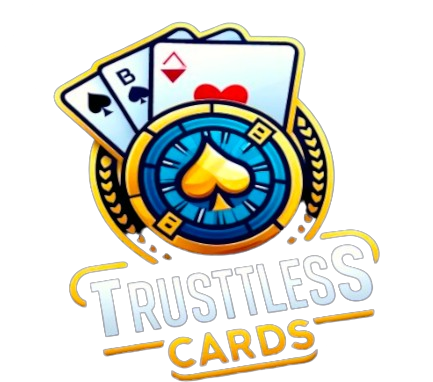

<div style="display: flex; justify-content: center; align-items: center; margin-bottom: 40px;">
  
  <div style=" justify-content: center; align-items: center;">
  <h3 style="font-size: 3rem; margin: 0;">Trustless Cards</h3>
  <p style="font-size: 1rem;">A New Era of Casino Games</p>
  </div>
</div>

# Team: 

Hugo Noyma: https://www.linkedin.com/in/hugo-noyma/
Rafael Coutinho: https://www.linkedin.com/in/rafael-coutinho2004/
Davi Arantes: https://www.linkedin.com/in/davi-ferreira-arantes/
João Pedro Sotto: https://www.linkedin.com/in/jo%C3%A3o-pedro-sotto-maior/

### Start Here!

[](https://youtu.be/2iOWa43vSwY)

<br/>
<br/>

# The Problem

In the world of casinos, the lack of trust and transparency are major concerns for players. Whether in traditional casinos or online with live dealers, there is always the possibility of game outcome manipulation, which reduces players' trust and fairness in the gaming experience. As a result, no matter what strategies players use or how much luck they have, they are always at a disadvantage, losing to the house. This creates an environment where players feel insecure and demotivated to invest their time and money.

# The Innovative Solution of Trustless Cards

Trustless Cards offers an innovative solution to these challenges of trust and transparency in casinos. Our platform leverages cutting-edge blockchain technology to ensure that every aspect of the game is transparent and fair. By utilizing Cartesi Rollups as a secure execution layer and Chainlink VRF to generate verifiable randomness, we ensure that the card shuffling process is not only truly random but also verifiable by anyone. This means that players can trust that only their skills and luck will determine the game outcomes, eliminating any doubts about manipulation.

# Our Value Proposition

The value proposition of Trustless Cards is simple: guarantee a fair game. By eliminating the possibility of game manipulation, we create a gaming environment where players can trust that their performance directly impacts their results. This not only enhances the player's experience but also creates a more engaged and confident player community. Additionally, we offer seamless integration with digital wallets, allowing players to deposit and withdraw funds quickly, without complications, providing convenience and efficiency.

# How the Technology Behind Trustless Cards Works

To ensure game fairness, Cartesi Rollups requests a random number from Chainlink VRF. The VRF generates a random number, which is then sent back to the Rollups. Using this verifiable random number, Cartesi Rollups shuffles the deck, ensuring that the process is genuinely random and cannot be tampered with. Finally, the shuffled deck is sent back to the client, ready to be played. This process ensures that each round of the game is fair and transparent.

# Solution Architecture

Our architecture is designed to maximize security and transparency. We use Cartesi Rollups as a Layer 3, ensuring the secure and efficient execution of smart contracts off the main chain. This allows our system to handle large volumes of transactions efficiently, keeping costs low for players. Additionally, the integration with Chainlink VRF provides a source of verifiable randomness, eliminating any possibility of game outcome manipulation.

# Next Steps

We are continuously innovating and expanding our offerings. In our next steps, we plan to introduce new games, such as blackjack and roulette, as well as online matches. We are also developing a game API service, allowing other companies to integrate our fair game technology into their platforms. This expansion not only diversifies our offerings but also reinforces our mission to bring transparency and fairness to as many players as possible.

# Conclusion

Trustless Cards is redefining the future of online casinos. By combining the security of blockchain technology with the transparency of verifiable randomness from Chainlink VRF, we offer a gaming experience where players can fully trust the outcomes. In this innovate environment, every victory is a direct reflection of the player's decisions and skills. We invite everyone to join us in this new era of casino games, where you control your own destiny and unlock your true potential with Trustless Cards.

<br/>
<br/>
<br/>

# How to Run the Trustless Cards Project

## Prerequisites:

- Docker installed
- Forge installed
- Node.js
- Yarn
- Cartesi CLI
- Go

## Steps:

**Start Docker:**

```
sudo systemctl start docker
```

**Build and Run the Backend:**

```
cd backend/
cartesi build
cartesi run --verbose
```

**Install Contracts:**

```
cd contracts
forge install
make vrf
```

- Note: Get the address from log.txt and update it in the VRFCoordinatorV2Mock contract in DeployTrustlessCards.s.sol.

**Deploy Trustless Cards:**

```
make trustless cards
```

- Note: Get the address from log2.txt and update it in the RandomWords component.

**Set up and Run the Frontend:**

```
cd frontend
yarn
yarn start
```
