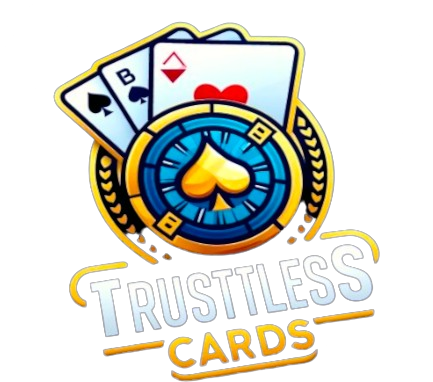

  

 
 

<h1>Problemática</h1>
Nos jogos de cartas online, a confiabilidade e transparência são questões críticas, frequentemente comprometidas pela possibilidade de manipulação dos jogos por casinos tradicionais. Esta desconfiança é agravada no processo de embaralhamento de cartas, um elemento central para a equidade dos jogos. Mesmo soluções que envolvem dealers ao vivo não eliminam completamente as dúvidas sobre a integridade do processo, deixando os jogadores cautelosos quanto à justiça do jogo. A falta de uma garantia palpável de aleatoriedade e imparcialidade compromete a experiência do usuário e mina a confiança nas plataformas de jogos online.

 

<h1>Solução</h1>
A TrustlessCards oferece uma plataforma inovadora para jogos de casino online, projetada para garantir total transparência e imparcialidade quanto a aleatóriedade das rodadas. Aproveitamos da segurança e transparência da blockchain para prover uma nova era dos jogos online. Na TrustlessCards, apenas sua habilidade e sorte determinam o resultado da partida.

 

<h1>Inspiração</h1>
Fomos inspirados pela necessidade de confiança e justiça nas casas de jogos, devido às inúmeras denúncias de manipulação em cassinos. Acreditamos que a tecnologia blockchain, combinada com soluções inovadoras como Cartesi Rollups, pode revolucionar o mercado de jogos online, proporcionando uma experiência segura e justa para todos os jogadores.

 

<h1>O que ele faz</h1>
A TrustlessCards utiliza a camada de execução da Cartesi juntamente com o Chainlink VRF para incorporar aleatoriedade no ambiente determinístico da Cartesi Machine. Assim, garantimos que o processo de embaralhamento seja verdadeiramente aleatório e verificável, eliminando qualquer possibilidade de manipulação. Tudo isso com perfeita integração a wallets, permitindo que o jogador faça saques e depósitos da plataforma rapidamente.

 

<h1>Desafios que enfrentamos</h1>
?

 

<h1>Conquistas de que nos orgulhamos</h1>
Estamos orgulhosos do projeto que construímos e da forma como nos organizamos durante o hackathon. Conseguimos criar uma plataforma funcional que entretém os usuários e aborda de maneira eficaz a problemática da integridade nas casas de jogos ao redor do mundo.

 

<h1>O que aprendemos</h1>
Aprendemos a integrar smart contracts de uma base layer com nosso backend na Cartesi Machine, utilizando HTTP Rollups server. De maneira geral, aprendemos muito sobre web3 e o ecossistema da Cartesi, e seu poder de solucionar dores de diversas áreas com escalabilidade, segurança e descentralização. Também aprendemos a trabalhar de forma eficiente e colaborativa com uma equipe recém-formada.

 

<h1>O que vem a seguir para Trustless Cards</h1>
Muito mais está por vir. No futuro, planejamos:

- Adicionar novos jogos, como roleta e black jack;
- Adicionar sistema de salas com partidas multiplayer;
- Integrações com outros protocolos de DeFi; ?
- Melhorar a experiência do usuário e a interface da plataforma;
